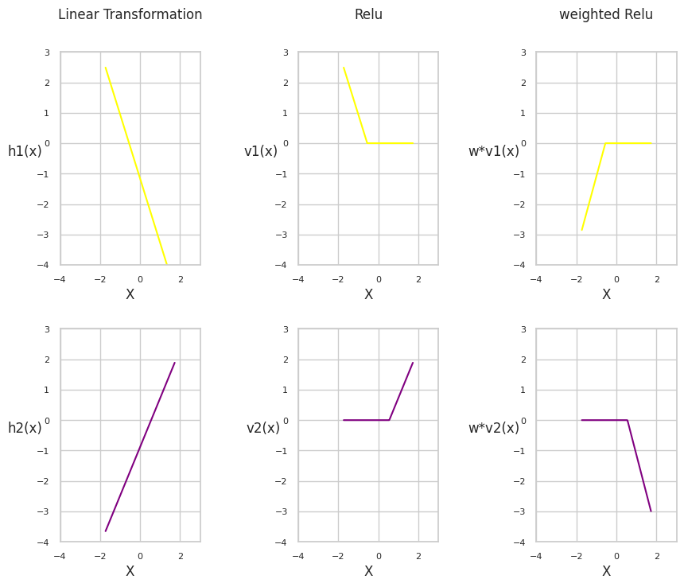

# The-story-of-Hidden-layers

The role of hidden layers and their visualization is often overlooked. In this notebook, we will attempt to visually follow a series of transformations on a dummy dataset trained on a simple neural network. The goal is to make less abstract the impact of hidden layers and activation functions (in our case, ReLU) on mapping the input (datapoints) to the prediction (y_hat).

